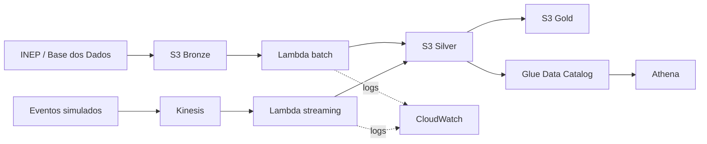

# Pipeline Híbrido para Análise da Alfabetização no Brasil

Tech Challenge — Fase 2, FIAP Pós-Tech AI Scientist.

O projeto implementa uma pipeline batch e streaming em Arquitetura Medalhão para analisar
indicadores municipais de alfabetização. A execução local é reproduzível e a implementação
cloud usa o AWS Academy Learner Lab na região `us-east-1`.

## Objetivo

A camada Gold responde quais UFs e municípios estão abaixo da meta, calcula o indicador
ponderado pelos alunos avaliados e prioriza municípios pelo déficit educacional. O ranking
apoia análise e não representa diagnóstico causal ou decisão automatizada.

## Arquitetura



| Camada | Conteúdo |
|---|---|
| Bronze | CSV original e histórico de ingestão |
| Silver | registros tipados, validados, deduplicados e em quarentena quando inválidos |
| Gold | indicadores ponderados por UF e ranking municipal de vulnerabilidade |

## Estrutura

```text
data/source/                 fixtures sintéticas exclusivas para testes e streaming
data/official/               extratos oficiais locais (ignorado pelo Git)
docs/                        decisões, FinOps, operação e implantação
infra/terraform/             infraestrutura AWS como código
scripts/publish_events.py    publicação de eventos no Kinesis
sql/                         fonte oficial e consultas analíticas
src/alfabetizacao_pipeline/  pipeline local e handlers AWS Lambda
tests/                       testes unitários e de integração
demo-local.ps1               demonstração offline em um comando
```

## Pipeline oficial

A entrada principal é o conjunto `br_inep_avaliacao_alfabetizacao`, publicado pelo INEP
na Base dos Dados. O pipeline integra `municipio`, `uf`, `meta_alfabetizacao_brasil`,
`meta_alfabetizacao_uf`, `meta_alfabetizacao_municipio` e `alunos`; o diretório de
municípios fornece nome e sigla da UF.

Após extrair as fontes conforme [docs/dados-oficiais.md](docs/dados-oficiais.md), execute:

```powershell
$env:PYTHONPATH = "src"
python -m alfabetizacao_pipeline.cli batch-official `
  --source-dir data/official `
  --output demo-output
```

Os extratos oficiais não são versionados. Alunos são filtrados e agregados no BigQuery,
gerando `alunos_agregados.csv`, sem identificadores individuais. O manifesto registra a
origem, os volumes e a quantidade de municípios excluídos por inconsistências.
Consulte o guia para estimar as consultas antes de usar `--execute`.

## Demonstração técnica local

Requer Python 3.11 ou superior e não precisa de internet:

```powershell
Set-ExecutionPolicy -Scope Process Bypass
.\demo-local.ps1
```

Sem os extratos oficiais, o script usa fixtures sintéticas apenas para testar código e
streaming. Seus resultados não são evidência estatística. Veja [DEMO_LOCAL.md](DEMO_LOCAL.md).

## Implementação AWS

A versão cloud usa somente serviços gerenciados de baixo custo:

- S3 para Bronze, Silver, Gold, quarentena e resultados do Athena;
- Lambda para batch e streaming;
- Kinesis Data Streams para eventos;
- Glue Data Catalog e Athena para descoberta e consulta;
- CloudWatch para logs e métricas;
- Terraform para provisionamento e destruição reproduzíveis.

O passo a passo está em [docs/implantacao-aws.md](docs/implantacao-aws.md). A implantação
deve ocorrer no Learner Lab, em `us-east-1`, e ser destruída após a gravação das evidências.

## Fonte dos dados

A fonte obrigatória é a [Avaliação da Alfabetização do INEP na Base dos Dados](https://basedosdados.org/dataset/073a39d4-89cf-4068-b1e8-34ed0d9c0b72).
A extração reproduzível está em `scripts/extract_official_data.py`, e a consulta integrada
de referência está em `sql/00_source_basedosdados.sql`. O adaptador devolve o contrato:

`ano`, `sigla_uf`, `id_municipio`, `nome_municipio`, `percentual_alfabetizado`,
`meta_percentual`, `total_avaliados`, comparativos de UF/Brasil, `fonte` e `data_ingestao`.

## Qualidade e segurança

- chave natural `(ano, id_municipio)` e prevalência da versão mais recente;
- percentuais entre 0 e 100, UF válida e código IBGE com sete dígitos;
- registros inválidos enviados à quarentena sem descarte silencioso;
- S3 privado, criptografia AES-256 e bloqueio de acesso público;
- funções Lambda executadas com a `LabRole` fornecida pelo AWS Academy Learner Lab;
- em produção, recomenda-se uma função IAM exclusiva com privilégio mínimo;
- nenhuma credencial ou dado individual de aluno no repositório.

## FinOps

O desenho evita clusters e recursos ociosos. Lambda cobra por invocação/duração; o Kinesis
usa apenas um shard durante a demonstração; logs ficam sete dias; e o Athena limita cada
consulta a 1 GiB lido. Consulte [docs/finops.md](docs/finops.md).

## Uso futuro em IA

A Gold pode alimentar regressão de indicadores e clustering territorial após enriquecimento
com Censo Escolar e variáveis socioeconômicas. O split deve ser temporal/geográfico e os
resultados precisam de auditoria de viés por UF e porte municipal.

## Evidências da validação na AWS

A infraestrutura foi implantada e validada no AWS Academy Learner Lab, em `us-east-1`.
Estas capturas históricas comprovam o ciclo técnico com a fixture inicial. A validação final
de dados deve ser refeita com os extratos oficiais antes da entrega.

| Etapa | Evidência |
|---|---|
| Implantação das funções e integração | [Terraform aplicado](docs/evidencias/terraform_implantado.png) |
| Processamento de 9 registros sem erros | [Execução batch](docs/evidencias/processamento_batch.png) |
| Objetos nas camadas Bronze, Silver e Gold | [Camadas no S3](docs/evidencias/camadas_s3.png) |
| Publicação dos eventos simulados | [Streaming](docs/evidencias/streaming.png) |
| Stream provisionado e ativo | [Kinesis Data Streams](docs/evidencias/data-stream-kinesis.png) |
| Funções batch e streaming em Python 3.12 | [AWS Lambda](docs/evidencias/lambda.png) |
| Consulta analítica concluída com sucesso | [Amazon Athena](docs/evidencias/athena.png) |
| Encerramento sem recursos remanescentes | [Terraform destroy](docs/evidencias/terraform_destroy.png) |

## Limitações

- as fixtures em `data/source` e `tests/fixtures` existem somente para testes automatizados;
- a execução final exige extratos reais da Base dos Dados em `data/official`;
- o Learner Lab restringe regiões, serviços, sessão e orçamento;
- a infraestrutura AWS precisa ser destruída ao final da demonstração;
- o projeto entrega a base analítica, não um modelo de IA treinado.
